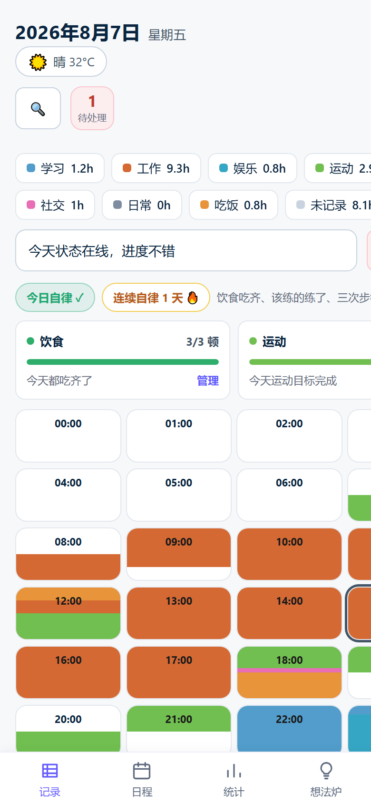
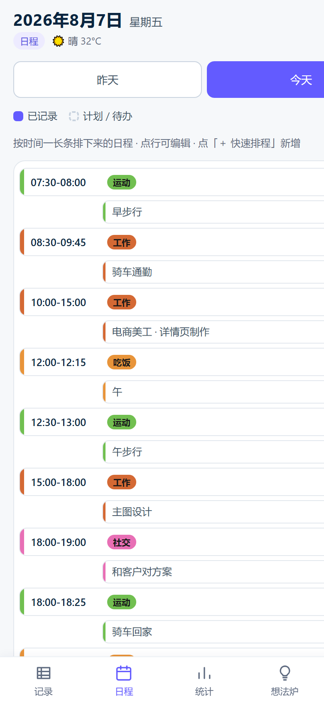
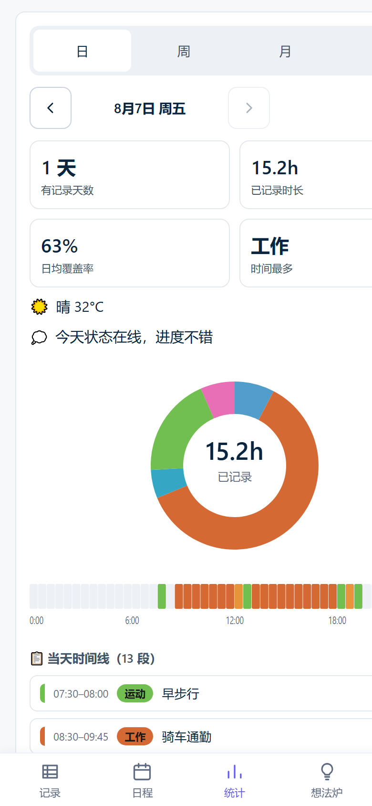

# 24H Time Log · 时间记录台

> A privacy-first, single-file 24-hour time journal for people who want to **track habits, journal their day, and stay honest with themselves** — without accounts, servers, or subscriptions.

  
  
  

**[Live demo →](https://fengdiandian888.github.io/24h-timelog/)** · works on any modern phone browser, or right-click the file and open locally — no install, no build, no nothing.

---

## What it does

- **24h timeline** — log what you did, hour by hour. Tap any capsule to fill in a time block (category + optional note). Two shortcuts (`+30m` / `+1h`) extend the end time cumulatively.
- **Habit check-ins that become real records** — breakfast / lunch / dinner, training day, three daily walks, two commute rides. Each check-in generates a real time-block event on the timeline in the matching category color. No floating "checked" badges.
- **One event per time slot** — overlap is auto-resolved: the newer block wins, the older one is either trimmed or removed. No double-booking.
- **Day plan view** — see all events of a day as a vertical list with category-color bars and time ranges.
- **Stats** — daily coverage, category breakdown donut chart, 24h heat-strip, weekly grid, monthly calendar, recent 7-day self-discipline history.
- **Yesterday + today** — quick-switch tabs at the top of every page.
- **Search** — find any past event by keyword or category.
- **PWA / offline** — install as an app icon on your phone, works offline, updates silently on each visit.
- **Self-discipline badge** — a checkmark only appears when you've actually hit the day's commitments (meals + training + walks). Honest feedback, not gamified noise.
- **Mobile-first** — built for a phone in your pocket. The desktop experience works but is not the target.

---

## Why this exists

Most "time tracker" apps want you to:
- Create an account
- Sync to their cloud
- Pay for the third year
- Display your week in a colorful dashboard you'll look at twice

This one wants you to **sit with your day and remember what you actually did**. The data never leaves your phone unless you explicitly export it. The whole app is a single HTML file you can save, email, or stash on a USB stick.

The interface is opinionated and personal — designed for one specific user (me) — but the data model is general enough to adapt to your own routines. See [Make it yours](#make-it-yours).

---

## Quick start

1. **Open** [`24小时时间记录台.html`](24小时时间记录台.html) by double-clicking it, or visit the [live demo](https://fengdiandian888.github.io/24h-timelog/).
2. **Tap any time capsule** (e.g. 14:00) → pick a category → optionally add a note → **Save**. That's a record.
3. **Tap the habit card** (饮食 / 运动) at the bottom to check off meals / training / walks. Each check-in draws a colored block on the timeline in the matching category.
4. **Swipe the day tabs** (昨天 / 今天) at the top to go back a day.
5. Tap the **统计** tab at the bottom for stats. Tap **日程** for a vertical list of the day.

Everything autosaves to your browser's local storage. Close the tab and come back tomorrow — your data is still there.

### Tips

- Edit a block: tap the colored block directly (not the capsule).
- Delete a block: open it → tap "清空这段" → you get a 5-second undo bar at the bottom.
- Add a free-form note: open any block and type in the "具体在做什么" field, press **Enter** to save.
- Move between days: tap "昨天" at the top.

---

## Make it yours

The default setup tracks **a Chinese commuter who rides 11.2 km daily, strength-trains Mon/Wed/Fri, and eats three meals**. Probably not you — that's fine, change it:

- **Open 设置 (Settings tab)** in the bottom nav.
- **饮食/运动打卡** → edit your meal times, training time, walks (each with start + end), commute times.
- **分类管理** → add / remove / recolor categories. Anything with the same key (`1`,`2`,`3`,`4`,`5`,`D`,`E`) is supported out of the box; custom keys work too.
- **每周目标** → set weekly hour goals per category (used in the Stats page).
- The cloud sync panel is there if you want a free backup path via GitHub Gist — totally optional, app works offline without it.

The app **does not** have a "user profile" — your schedule lives in `localStorage` under `wb_t24_cfg`. To reset everything: Settings → 清空数据 (requires you to type the word "清空" to confirm — the button is greyed out until then).

---

## Tech

- **Single HTML file**, ~170 KB, vanilla JS, zero dependencies, zero build step.
- State persisted in `localStorage` (4 keys: days / ideas / posts / cats / cfg).
- PWA: `manifest.webmanifest` + service worker, installable, offline-capable, network-first updates.
- 7 regression test suites (~70 assertions) in `_*verify.js` cover syntax, habit linkage, search, reminders, time-uniqueness carving, walk ranges, and the "all records are real events" iron rule.
- Static audit (`_audit.js`) cross-checks every defined function, inline event reference, and `getElementById` against the HTML — zero orphans, zero missing IDs.

---

## Privacy

- 100% client-side. No analytics, no telemetry, no network calls except optional GitHub Gist backup (which you set up yourself).
- Data never leaves the browser unless you tap "导出 JSON".
- Clearing browser data clears the app. Back up via 设置 → 数据 → 导出 before clearing.

---

## License

MIT — do whatever you want with the code. If you build something useful on top of this and tell me about it, that'd make my day.

---

Built for one person. Sharing it anyway. · [fengdiandian888/24h-timelog](https://github.com/fengdiandian888/24h-timelog)

